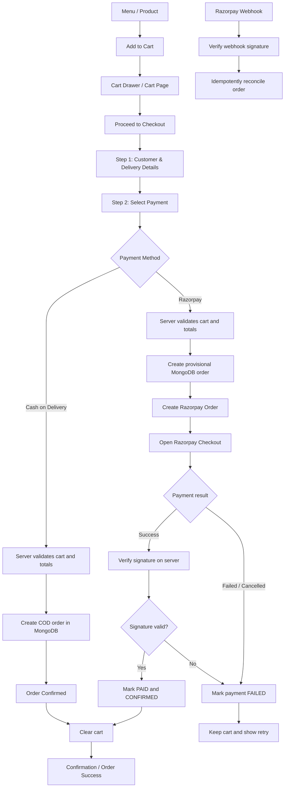

# Sawariyawala Food & Caterers

A production-style, full-stack ordering and catering website built in Next.js 16 with the App Router. The visual system comes from the supplied Sawariyawala brand lookbook: deep navy, saffron, warm cream and peacock teal; premium serif typography; food-first layouts; restrained flute, steam and peacock-feather cues.

The public Fateh Ki Kachori site informed only the storytelling rhythm and navigation model. No Fateh logo, copy, code or remotely hosted imagery is used.

## Features

- Responsive Home, Menu, Product Detail, Story, Why Us, Catering, Contact, Cart, Checkout, Order Success and Track Order pages
- MongoDB + Mongoose product, category, order and contact-message persistence
- Editable, rerunnable menu seed data sourced from the lookbook's placeholder menu
- Zustand cart with localStorage persistence, cart drawer and dedicated cart page
- Server-authoritative totals, delivery charge and free-delivery threshold
- Cash on Delivery orders
- Razorpay server order creation, HMAC verification and idempotent webhook reconciliation
- Private success-page access token and order tracking by order number plus phone/email
- Protected admin dashboard for product pricing/visibility, orders/status and messages
- Zod validation, endpoint rate limiting, secure admin cookie, local optimized assets and Next/Image
- Sitemap, robots rules, metadata, keyboard focus states and reduced-motion support

## Prerequisites

- Node.js 20.9 or newer
- MongoDB 7 locally, MongoDB Atlas, or Docker
- Razorpay test keys for online payment testing

## Setup

```bash
npm install
copy .env.example .env.local
docker compose up -d
npm run seed
npm run dev
```

Open `http://localhost:3000`.

If MongoDB or Docker is not installed, you can run the full application with a
disposable local database instead:

```bash
npm run dev:memory
```

This mode is intended for local demos and checkout testing. Its data is removed
when the development server stops.

## Environment

Fill `.env.local` from `.env.example`:

- `MONGODB_URI`: MongoDB connection string
- `NEXT_PUBLIC_SITE_URL`: canonical site URL
- `RAZORPAY_KEY_ID` and `RAZORPAY_KEY_SECRET`: server credentials
- `NEXT_PUBLIC_RAZORPAY_KEY_ID`: Razorpay public checkout key
- `RAZORPAY_WEBHOOK_SECRET`: webhook signing secret
- `ADMIN_EMAIL`, `ADMIN_PASSWORD_HASH`, `AUTH_SECRET`: admin login configuration
- `DELIVERY_CHARGE`, `FREE_DELIVERY_THRESHOLD`: order rules

Generate a bcrypt password hash without placing the password in source control:

```bash
node -e "require('bcryptjs').hash(process.argv[1], 12).then(console.log)" "choose-a-strong-password"
```

Place the output in `ADMIN_PASSWORD_HASH`. Use a long random value for `AUTH_SECRET`.

## MongoDB and seed data

`npm run seed` safely upserts four categories and seventeen products, so it can be rerun. The lookbook explicitly labels menu prices as placeholder content; edit them in `/admin/products` before launch.

## Payment behavior

COD creates a confirmed order with pending payment. Razorpay requires valid keys; the application never fakes a successful online payment. The browser receives only the public key. The server creates the gateway order, recalculates totals from MongoDB, and verifies payment signatures before marking an order paid.

Configure the Razorpay webhook URL as:

```text
https://your-domain.com/api/payments/razorpay/webhook
```

Subscribe to `payment.captured` and `payment.failed` and use the same signing secret as `RAZORPAY_WEBHOOK_SECRET`.



## Admin

Visit `/admin/login`. The admin area remains locked until all three admin environment variables are configured. Product updates and order-status changes are server-authorized using an HTTP-only signed cookie.

## Production

```bash
npm run lint
npm run typecheck
npm run build
npm start
```

Deploy to any Next.js-compatible Node host and supply production environment variables there. Use MongoDB Atlas or another reachable MongoDB instance. Point Razorpay to the production webhook URL only after HTTPS is enabled.

## Launch checklist

- Replace placeholder phone, email, address, hours, map and social links in `src/config/site.ts`
- Review all seed prices and product descriptions
- Add real Razorpay test keys and run a test-mode payment
- Configure admin credentials
- Test at 360, 390, 430, 768, 1024, 1280 and 1440+ widths
- Confirm fulfilment rules, legal copy, refund policy and serviceable pincodes

## Source limitations and assumptions

- The separate composite screenshot and screen recording referenced by the master specification were not supplied in the final request.
- The PDF supplied brand identity and visual applications but no verified address, phone, hours, social links, founding date or customer testimonials. These remain clearly configurable placeholders.
- Testimonials in the Home page are marked in code as editable demo content.
- Product imagery is locally derived from the supplied lookbook illustrations; replace with final product photography without changing component code.
